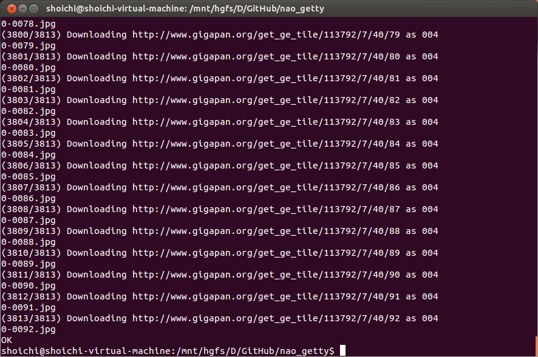
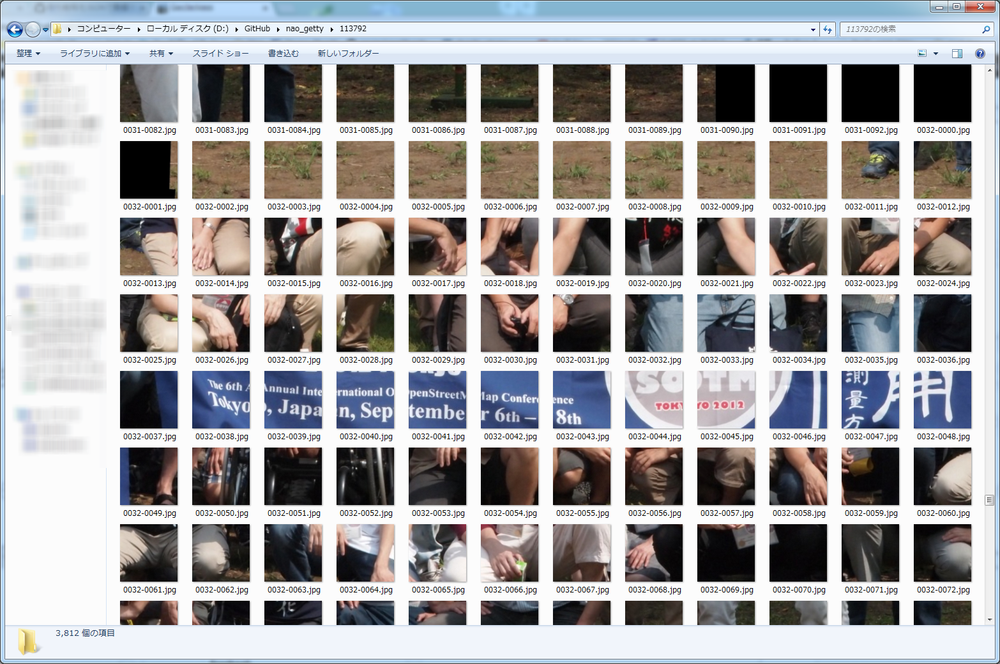

nao_getty produced by Shoichi Otomo [@geojackass](https://twitter.com/geojackass)
=========

タムケンがgigapan downloaderが使えないとか言うので、超簡単に使えるようにカスタマイズしたものです。  
[Gigapan-Downloader-and-stitcher](https://github.com/DeniR/Gigapan-Downloader-and-stitcher)  

### 使い方
1. まず初めに、このリポジトリをクローンします。  
  
  ```
  git clone https://github.com/geojackassShoichi/nao_getty
  ```  
2. 次にクローンしたnao_gettyというディレクトリへ行きます。  


3. ダウンロードしたいGigaPanの写真IDを入力して、kick.shを起動します。
  - 例えば 113792というIDの写真をダウンロードしたい場合は下記のように入力します。  
  ```
  sh kick.sh 113792
  ```

4. 実行すると、指定したIDの番号で新規にディレクトリを作成しダウンロードを開始します。
IDで指定した画像を構成するイメージファイル(.jpg)は、そのディレクトリの中にダウンロードされます。

	- OK と表示されれば、問題ありません。無事にダウンロードできました。


	- IDで指定した画像を構成するイメージファイル(.jpg)


##### 変更点は、2つあります。  
1. デフォルトで最高画質のイメージをダウンロードするようにしてあることです。  
2. stich後の画像を.tifで出力するように指定してあります。
  - ただしこの機能はMemoryAllocationFaildを起こす事が多いので、コメントアウトして外してあります。
  - 使用したい場合は、コメントアウトを外してsubprocessを有効にしてください。
  - また、その際はImageMagickが予めインストールされていることを確認してください。[ImageMagick](http://www.imagemagick.org/)

=======

License
=======

### Released under the MIT license
##### Copyright (c) 2014 Shoichi Otomo [@geojackass](https://twitter.com/geojackass)

- read under the MIT LICENSE  
[Open Source Initiative](http://opensource.org/licenses/mit-license.php)  

>
Permission is hereby granted, free of charge, to any person obtaining a copy of this software and associated documentation files (the "Software"), to deal in the Software without restriction, including without limitation the rights to use, copy, modify, merge, publish, distribute, sublicense, and/or sell copies of the Software, and to permit persons to whom the Software is furnished to do so, subject to the following conditions:  
The above copyright notice and this permission notice shall be included in all copies or substantial portions of the Software.  
THE SOFTWARE IS PROVIDED "AS IS", WITHOUT WARRANTY OF ANY KIND, EXPRESS OR IMPLIED, INCLUDING BUT NOT LIMITED TO THE WARRANTIES OF MERCHANTABILITY, FITNESS FOR A PARTICULAR PURPOSE AND NONINFRINGEMENT. IN NO EVENT SHALL THE AUTHORS OR COPYRIGHT HOLDERS BE LIABLE FOR ANY CLAIM, DAMAGES OR OTHER LIABILITY, WHETHER IN AN ACTION OF CONTRACT, TORT OR OTHERWISE, ARISING FROM, OUT OF OR IN CONNECTION WITH THE SOFTWARE OR THE USE OR OTHER DEALINGS IN THE SOFTWARE.
