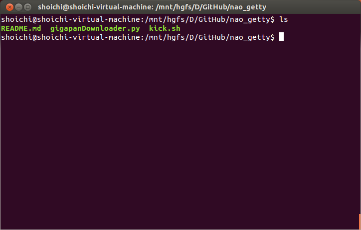

nao_getty
=========

タムケンがgigapan downloaderが使えないとか言うので、超簡単に使えるようにカスタマイズしたものです。  
[Gigapan-Downloader-and-stitcher](https://github.com/DeniR/Gigapan-Downloader-and-stitcher)
#### 使い方
1. まず初めに、このリポジトリをクローンします。  
  
  ```
  git clone https://github.com/geojackassShoichi/nao_getty
  ```  
2. 次にクローンしたnao_gettyというディレクトリへ行きます。  


3. ダウンロードしたいGigaPanの写真IDを入力して、kick.shを起動します。
  - 例えば 113792というIDの写真をダウンロードしたい場合は下記のように入力します。  
  ```
  sh kick.sh 113792
  ```

### 変更点は、2つあります。  
1. デフォルトで最高画質のイメージをダウンロードするようにしてあることです。  
2. 画像をtifでダウンロードすることです。  

ImageMagickが入っていない場合や、通常のPCで起動すると恐らく最後にMemoryAllocationFaildと表示されます。  
ダウンロードだけ出来れば良いと言う場合用のもので、このコメントは無視して下さい。
